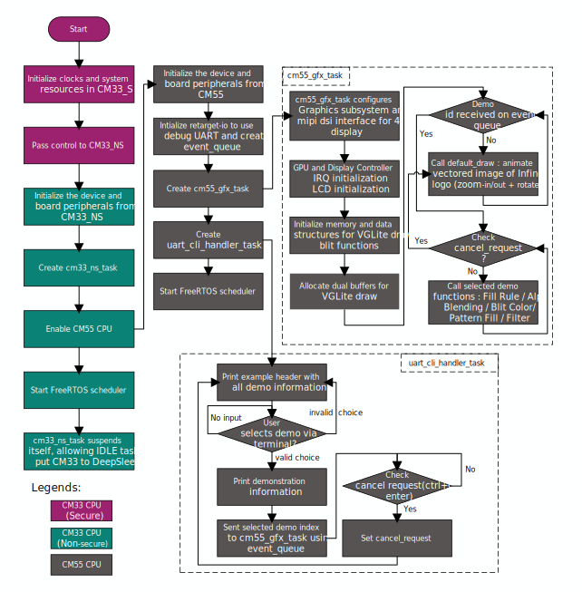

[Click here](../README.md) to view the README.

## Design and implementation

This project supports following display:

- **[Waveshare 4.3-inch Raspberry Pi DSI LCD Display](https://www.waveshare.com/4.3inch-dsi-lcd.htm):** The LCD houses a Chipone ICN6211 display controller and uses the MIPI DSI interface

All PSOC&trade; Edge E84 MCU applications have a dual-CPU three-project structure to develop code for the CM33 and CM55 cores. The CM33 core has two separate projects for the secure processing environment (SPE) and non-secure processing environment (NSPE). A project folder consists of various subfolders, each denoting a specific aspect of the project. The three project folders are as follows:

**Table 1. Application projects**

Project | Description
--------|------------------------
*proj_cm33_s* | Project for CM33 secure processing environment (SPE)
*proj_cm33_ns* | Project for CM33 non-secure processing environment (NSPE)
*proj_cm55* | CM55 project

 

In this code example, at device reset, the secure boot process starts from the ROM boot with the secure enclave (SE) as the root of trust (RoT). From the secure enclave, the boot flow is passed on to the system CPU subsystem where the secure CM33 application starts. After all necessary secure configurations, the flow is passed on to the non-secure CM33 application. Resource initialization for this example is performed by this CM33 non-secure project. It configures the system clocks, pins, clock to peripheral connections, and other platform resources. It then enables the CM55 core using the `Cy_SysEnableCM55()` function and allows Idle task to put CM33 in DeepSleep mode.

In the CM55 application, the clocks and system resources are initialized by the BSP initialization function. The retarget-io middleware is configured to use the debug UART. The debug UART prints a message as shown in the [Terminal output on program startup](../images/terminal-default-demo-select-option.png). The onboard KitProg3 acts the USB-UART bridge to create the virtual COM port.

The CM55 application drives the LCD and renders the image using the PSOC&trade; Edge graphics subsystem, which houses an independent 2.5D GPU, a display controller (DC), and a MIPI DSI host controller with a MIPI D-PHY physical layer interface.

The GPU supports vector graphics (drawing circles, rectangles, quadratic curves) and font support. This code example implements operations like rotate/scale, color fill, and color conversion. After the GPU renders the frames, they are transferred to the MIPI DSI host controller via the DC and displayed on the LCD.

Following are a few important components of this code example:

- **_proj_cm55/infineon_logo_paths.h_:** This file defines the vector path data for the Infineon logo, which is rendered using the 'vg_lite_draw' API. The path data is manually extracted from images/infineon_logo.svg by mapping the vector path opcodes required for plotting. This vector path is used in the 'default_draw' function to animate the logo with zoom-in/out and rotation effects, and it is also utilized in the blit color rendering demo, where the rectangle containing the logo (rendered via 'vg_lite_draw') is processed using the 'vg_lite_blit_rect' API.

- **_proj_cm55/infineon_logo.h_:** This file contains the C array holding the pixel data for the Infineon logo image. It is used in the Pattern Fill Demonstration to render the Infineon logo within four different shapes.

- **_icon/*.h:_** These header files define the C arrays that hold pixel data for the four icons. They are used in the filter demo, where the VG_LITE_FILTER_LINEAR filter is applied to them.

- **Application code:** The CM55 CPU utilizes the graphics subsystem and VGLite APIs to demonstrate five different use cases. The `main` function (**proj_cm55/main.c**) first initializes the BSP. It then performs retarget-io initialization to use the debug UART port and creates an `event_queue` to receive notifications of selected demonstrations. After this, it creates the `cm55_gfx_task` and `uart_cli_handler` FreeRTOS tasks

- **`cm55_gfx_task`:** This task is responsible for initializing the graphics subsystem. It initializes the LCD panel through the I2C interface, initializes the VGLite engine, creates buffers, and configures the identity matrix. After initialization, it enters a loop where it checks the 'event_queue'. If no events are received, it calls the 'default_draw' function to display the Infineon logo with zoom and rotation effects as the default screen. When a demo number is received, the corresponding demo function is executed repeatedly until the 'cancel_requested' flag is set. Once cancellation is triggered, the task exits the demo loop and returns to the main loop, continuing to check the event_queue and call 'default_draw'. It also logs FPS and CPU usage to the UART terminal throughout execution.

- **`uart_cli_handler`:** This task manages user interaction through the UART terminal. It first displays the header "PSOC Edge MCU: Graphics using VGLite API" and lists five GPU operations to be demonstrated. When the user selects one of the listed operations by entering its corresponding number (1 to 5), it prints information about the selected operation and sends the operation serial number to 'cm55_gfx_task' via the 'event_queue'. To exit a running GPU operation and return to the default display, the user can press Ctrl+C or Enter. When this occurs, the task sets the 'cancel_requested' flag to notify 'cm55_gfx_task' to stop the active operation and resume the default loop.

On the other hand, **cm33_ns_task** freeRTOS task puts the CM33 CPU to DeepSleep mode. 

**Figure 1. Code flow chart**

   
 